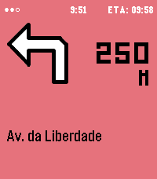
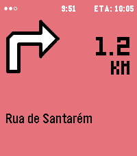
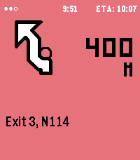
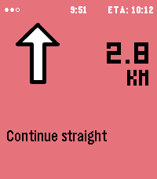

# Steer — Pebble turn-by-turn navigation watchapp

Steer mirrors turn-by-turn navigation from your phone onto a Pebble watch:
the next maneuver icon, distance, street/instruction text, ETA, and an
optional speedometer and over-limit alert. It is the watch half of a two-part
project — the [Steer companion Android app](https://github.com/bquelhas/steer-companion)
reads navigation from your map app and forwards it here.

Built with the Pebble SDK for **aplite, basalt, chalk, diorite and emery**
(Pebble Time 2 is the main target).

## Screenshots

Captured on the emery (Pebble Time 2) emulator, driving a simulated trip:

| Turn left | Turn right | Roundabout exit |
|:---:|:---:|:---:|
|  |  |  |

| Continue straight | Arrival |
|:---:|:---:|
|  |  |

## Features

- Next-maneuver icon (a 41-entry maneuver set drawn as Pebble Draw Commands,
  plus raw-icon passthrough for map apps that ship their own glyphs).
- Distance + street/instruction line with an animated digit "squash" morph.
- ETA display.
- Configurable background colour, per-turn vibration.
- Optional speedometer and speed-limit alert (fed by the phone's GPS).
- Favourite destinations you can launch straight from the watch.

## Building

Requires the [Pebble SDK](https://developer.repebble.com) (`pebble` on your
`PATH`).

```sh
pebble build                       # build for every platform in package.json
pebble install --emulator emery    # run on the emery emulator
pebble install --phone <ip>        # install to a paired phone
```

## Project layout

```
src/c/           C source for the watchapp (navme.c)
resources/img/         menu icon
resources/pebble_icons/pdc/   maneuver icons (Pebble Draw Command format)
package.json     UUID, target platforms, message keys, bundled resources
wscript          Pebble build rules
```

## Phone ↔ watch protocol

The watch receives AppMessages keyed by the `messageKeys` block in
`package.json` (`NAV_TURN`, `NAV_TEXT`, `NAV_ICON_BITMAP`, `NAV_ETA`,
`NAV_SPEED`, favourites, …). See the companion app for the sending side.

## Licence

MIT — see [LICENSE](LICENSE). Third-party credits in [CREDITS.md](CREDITS.md).
